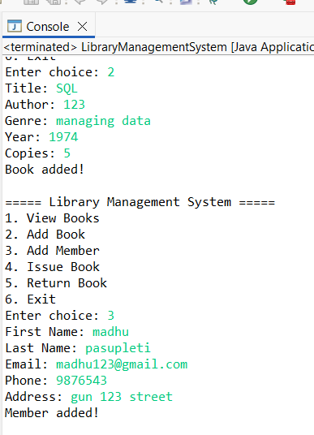

# 📚 Library Management System (Java + JDBC + MySQL)

## 🚀 Overview
This project is a **Library Management System** developed using Java. It is designed to manage basic library operations such as adding, updating, issuing, and returning books. The application uses **JDBC** to connect with a **MySQL database** and perform CRUD operations efficiently.

---

## 🛠 Technologies Used
- Java  
- JDBC (Java Database Connectivity)  
- MySQL  
- SQL  

---

## ✨ Features
- Add new books to the library  
- Update book details  
- Delete book records  
- Issue books to users  
- Return books  
- Input validation for better data handling  

---

## 📂 Project Structure
Library-Management-System/
│── src/
│ └── LibraryManagementSystem.java
│── database/
│ └── database.sql
│── screenshots/
│ ├── Screenshot1.png
│ └── Screenshot2.png
│── README.md

## ▶️ How to Run the Project

1. Clone the repository:
git clone https://github.com/aharini-codes/Library-Management-System.git

2. Open the project in Eclipse or IntelliJ IDEA  

3. Set up the database:
   - Open MySQL  
   - Import the `database.sql` file  

4. Update database credentials in the Java file  

5. Run the `LibraryManagementSystem.java` file  

---

## 🖼️ Output Screenshots

---

## 💡 Key Learnings
- Implemented JDBC for database connectivity  
- Performed CRUD operations using SQL  
- Improved problem-solving and debugging skills  
- Learned how to structure a real-world Java project  

---

## 🚀 Future Improvements
- Add GUI using Java Swing or JavaFX  
- Implement user authentication (login system)  
- Convert into a web-based application  
- Enhance UI/UX for better user experience  

---

## 👩‍💻 Author
**Harini**  
- GitHub: https://github.com/aharini-codes  
- LinkedIn: www.linkedin.com/in/harini-a-344249384

---

## ⭐ Acknowledgment
This project was developed as part of learning **Java Full Stack Development** and to gain hands-on experience with real-world applications.
